# Autores
[Damian Lipschitz](https://github.com/damianlips)

[Federico Quijada](https://github.com/FedeNQ)

[Fidel Dalmasso](https://github.com/fideldalmasso)

# Overview
Patitas es una plataforma para que los profesionales y/o entusiastas de las mascotas puedan gestionar y realizar actividades con relación a ellas. Dichas actividades pueden ser las siguientes:
* Mascota perdida: es decir, la persona puede indicar que su mascota se extravió, indicando características y el lugar del último misma.
* Mascota encontrada: Se puede indicar, también, que un animal fue encontrado en una zona en particular, con el fin de que su dueño lo encuentre.
* Mascota en tránsito/adopción: En algunos casos, puede ser que el animal indicado este en pedido de tránsito, o bien de adopción responsable, esta opción está principalmente orientado a protectoras, pero puede ser utilizado por quien necesite.

Para realizar dichas actividades, la aplicación permite crear publicaciones, que poseen información necesaria:
* Tipo de publicación: Se divide en perdida, encontrada, tránsito, adopción.
* Tipo de animal: De momento, los animales son Perro, Gato, y Otro.
* Título y descripción: con el fin de poder detallar libremente, brindando información más específica que no está abarcada en los demás campos.
* Imagen: Se puede colocar una imagen relacionada a la mascota, esta puede ser obtenida de la galería, como así también de la cámara.
* Ubicación: Idealmente, el lugar donde fue visto por última vez el animal.

# Funcionalidades
* Geolocalización: Integración con mapas de Google y servicios de ubicación precisa
* Autenticación de usuarios (log in y sign in). Integración con Google
* Publicación: Crear, compartir, responder.
* Mensajería

# Herramientas utilizadas
* AndroidX con Java
* Google Firebase
* Google cloud
* Google Maps SDK

# Screenshots

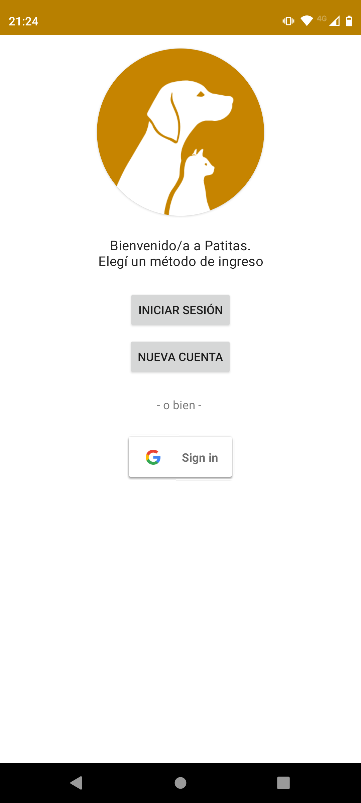
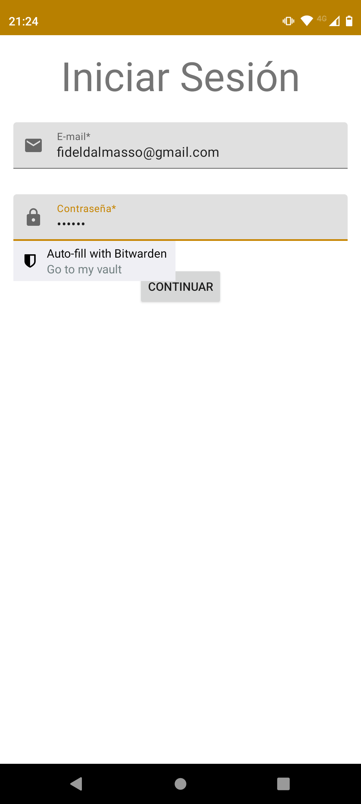
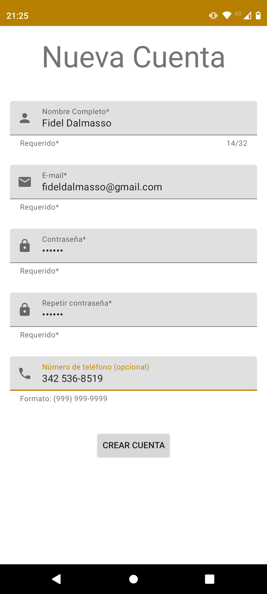

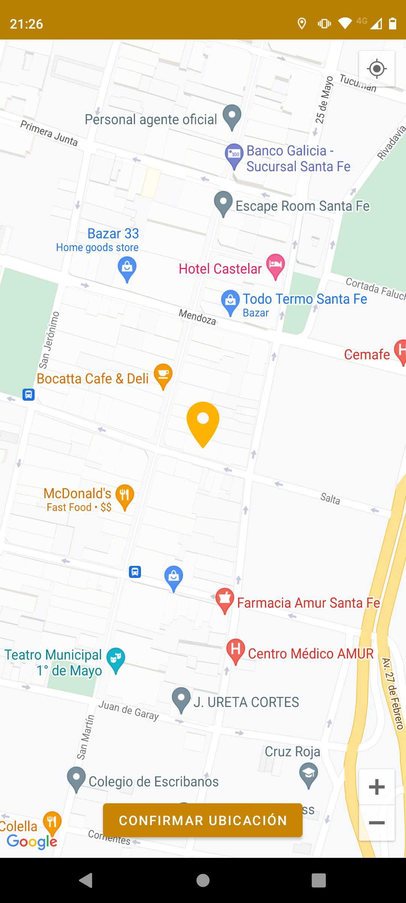
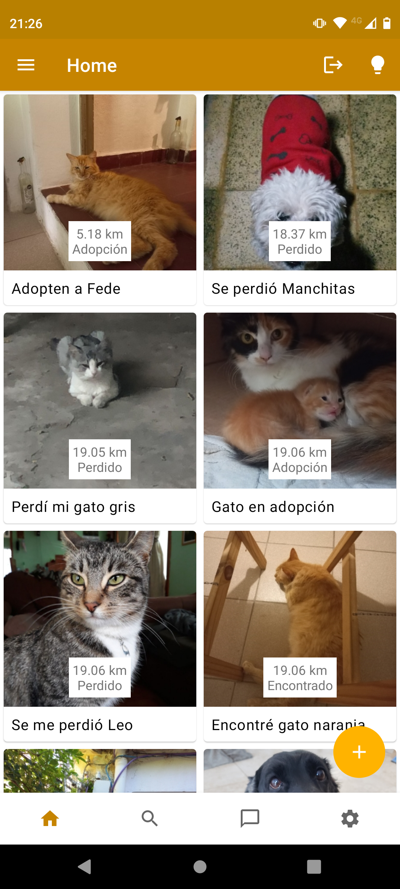
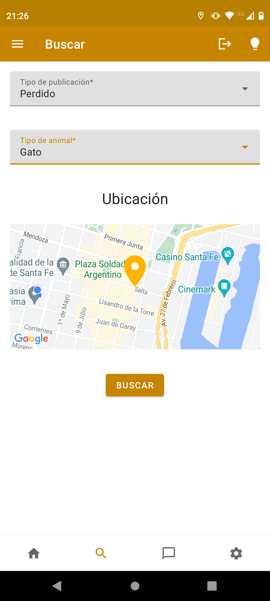

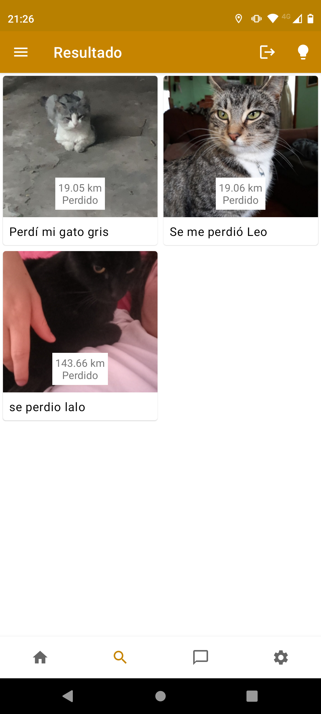
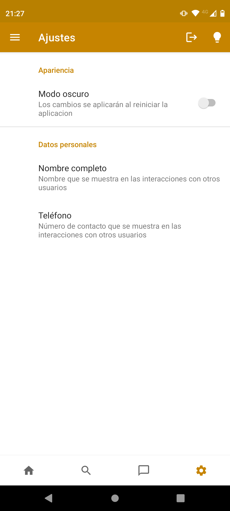
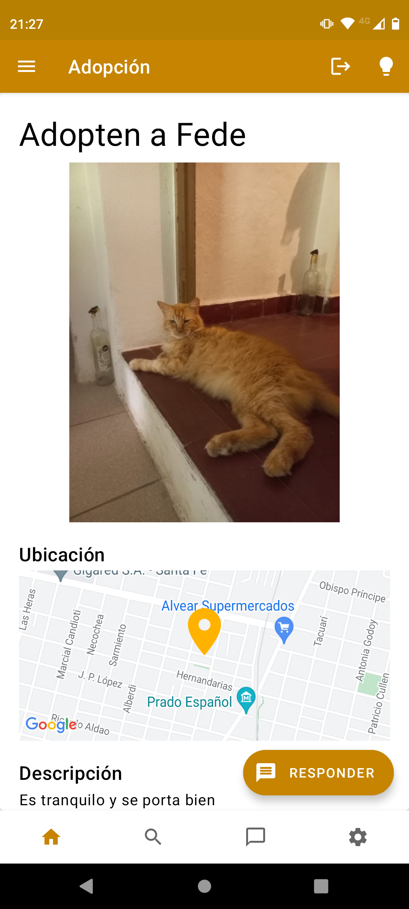

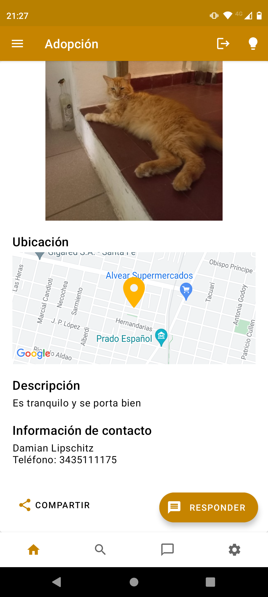
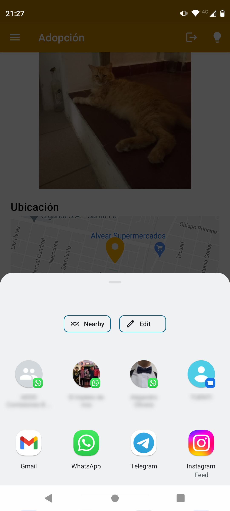
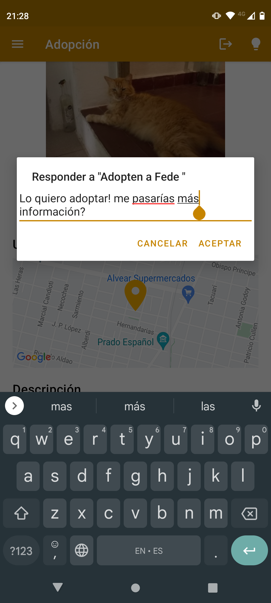

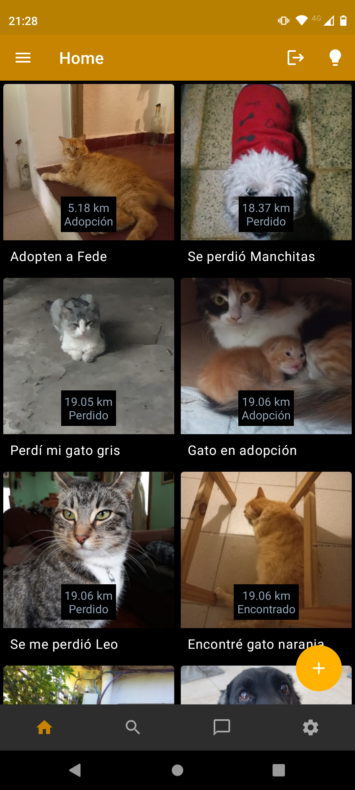
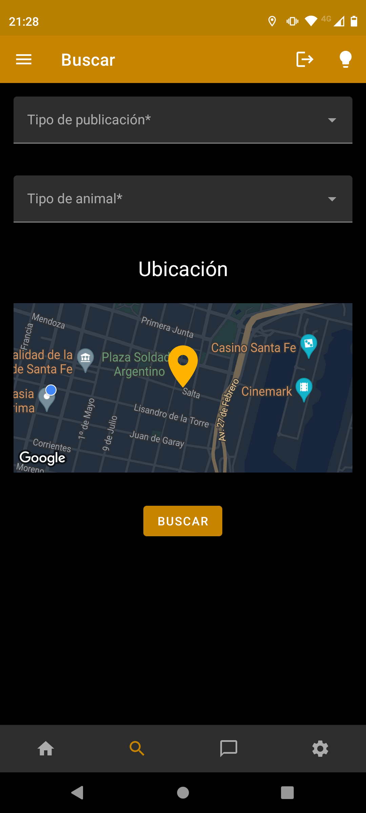

Logo: [Victoria Rodriguez](https://www.behance.net/vickyrodriguez2)
